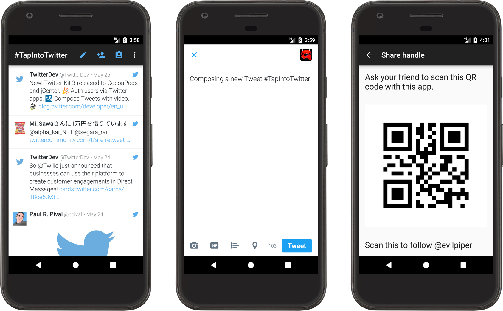

# Hashtrends

A sample Android app using Twitter Kit and Twitter trends to help users follow what's trending in there surroundings.

(originally written by Shivank Gupta,Shivam Gupta, Naman Saxena as a sample using Twitter Sdk kit and twitter api).

## Features

* Trending hashtag timeline
* HashTag search according to the location(eg: India, Winnipeg, Toronto, Jaipur)
* Checks the Category of the HashTag(eg: Tech, Politics, News etc)
* Allows to to see hashtag related tweets
* Allows you to enter the group chat and start the disscussion on a relatable topic

## Twitter Kit features

This app uses the following Twitter Kit features:

 * native Tweet Composer
 * Sign in with Twitter
 * Search Timeline
 * Twitter API calls
 * Twitter API client extension

## Building

If you want to run the app locally, do the following:

1. Import the project in your IDE (we use gradle to build)
2. Create a Twitter app at apps.twitter.com
3. Rename `app/twitter.sample.properties` to `app/twitter.properties`
4. Fill in your keys there
5. Customize the `strings.xml` file with your event hashtags and search criteria
5. Run it

See [how to integrate the SDK](https://dev.twitter.com/twitterkit/android/installation) if you need more help.

## Get support

If you need support to build the app or to understand any part of the code, let us know. Email your question at the [Email Id](shivank.1404@gmail.com).

## Contributors

* [Shivank Gupta](https://www.linkedin.com/in/shivank-gupta-1404/)

